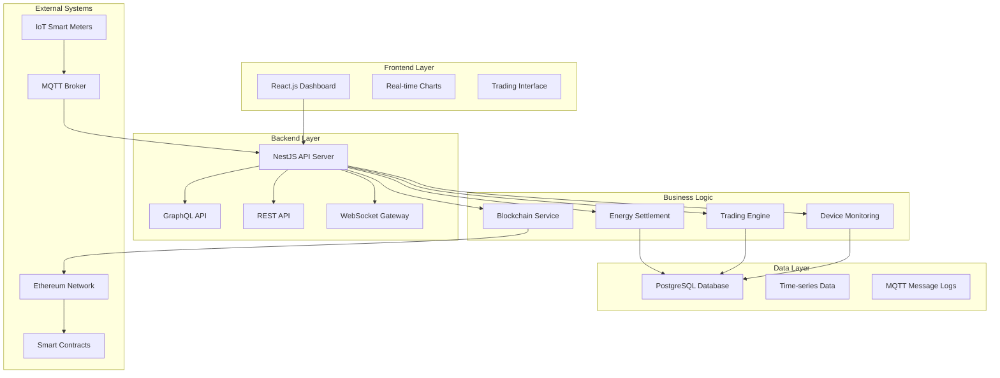
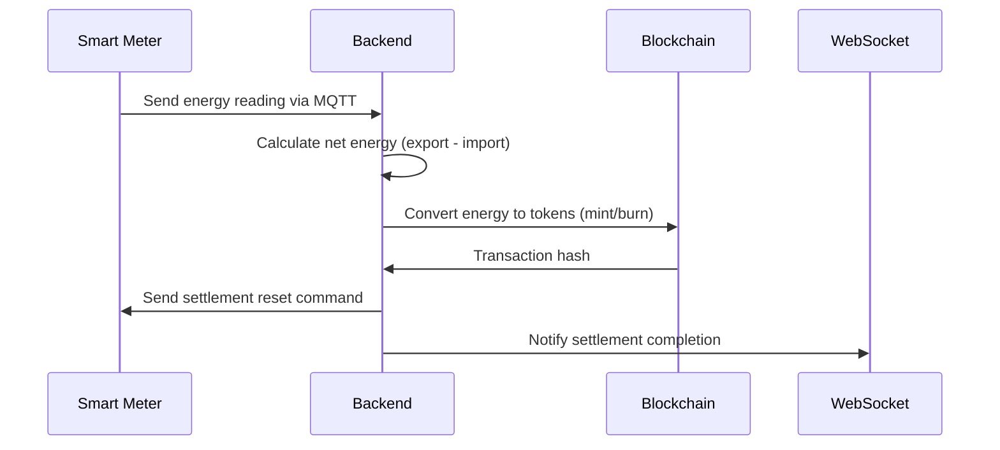
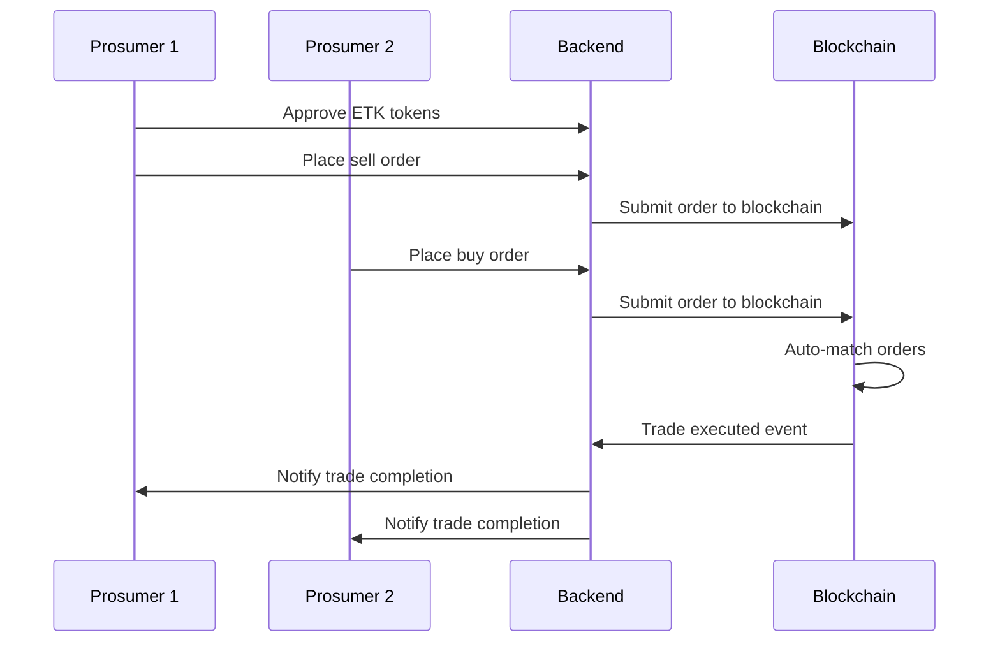
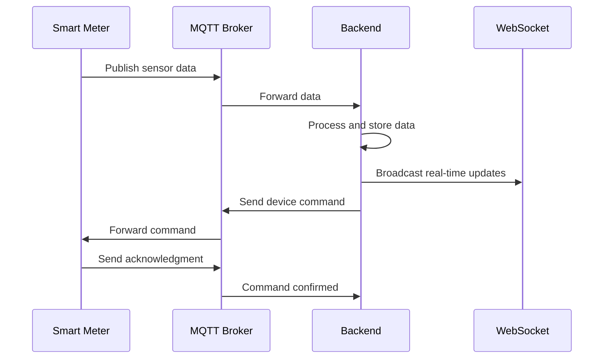

# EnerLink P2P Energy Trading System - Backend Implementation

## 🎯 Project Overview

EnerLink is a comprehensive peer-to-peer energy trading platform that enables prosumers (PLTS Atap owners) to trade surplus energy using three core technologies:

- **IoT**: Smart meters with comprehensive monitoring and control capabilities
- **Private Ethereum Blockchain**: Secure, automated transactions with tokenization
- **Modern Web Application**: NestJS backend + ReactJS frontend

## 🏗️ Architecture

### System Components



### Token System

- **ETK (Energy Token)**: Represents energy units (1 kWh = 1 ETK by default)
- **IDRS (Indonesian Rupiah Stablecoin)**: Stable token for payments (1 IDR = 1 IDRS)
- **Tokenization**: Physical energy converted to digital tokens for trading

## 🚀 Features Implemented

### ✅ Core Infrastructure
- [x] **NestJS Framework**: Modular architecture with dependency injection
- [x] **TypeORM**: Database ORM with PostgreSQL
- [x] **GraphQL**: Flexible data querying with Apollo Server
- [x] **Authentication**: JWT-based auth with role-based access
- [x] **Environment Configuration**: Secure config management
- [x] **Error Handling**: Comprehensive exception filters and logging
- [x] **Validation**: Class-validator with DTO validation
- [x] **Rate Limiting**: Throttling with custom guards

### ✅ Authentication & Authorization
- [x] **User Registration/Login**: Prosumer account management
- [x] **JWT Strategy**: Secure token-based authentication
- [x] **Password Security**: Bcrypt hashing
- [x] **Protected Routes**: Guard-based route protection
- [x] **User Context**: Request user injection

### ✅ IoT Integration
- [x] **MQTT Service**: Bidirectional communication with smart meters
- [x] **Device Management**: Smart meter registration and monitoring
- [x] **Command System**: Remote device control with correlation tracking
- [x] **Heartbeat Monitoring**: Device health and status tracking
- [x] **Data Collection**: Real-time energy readings processing

### ✅ Energy Management
- [x] **Energy Readings**: Time-series data collection and storage
- [x] **Settlement Engine**: Automated periodic energy settlement
- [x] **Blockchain Integration**: ETK token minting/burning for energy conversion
- [x] **Manual Settlement**: On-demand settlement processing
- [x] **Settlement History**: Complete audit trail

### ✅ Blockchain Integration
- [x] **Wallet Management**: Encrypted private key storage
- [x] **Smart Contract Integration**: Energy converter and market contracts
- [x] **Token Operations**: ETK and IDRS token management
- [x] **Transaction Logging**: Comprehensive blockchain transaction tracking
- [x] **Event Listening**: Real-time blockchain event processing

### ✅ Trading System
- [x] **Order Management**: BID/ASK order placement and tracking
- [x] **Market Data**: Real-time trading statistics
- [x] **Order Book**: Cached order book from blockchain events
- [x] **Trade Execution**: Automated order matching
- [x] **Balance Checking**: Real-time wallet balance queries

### ✅ Real-time Features
- [x] **WebSocket Gateway**: Real-time notifications
- [x] **Event Broadcasting**: System-wide event notifications
- [x] **Device Alerts**: Real-time device status updates
- [x] **Trading Notifications**: Order and trade notifications
- [x] **Settlement Updates**: Energy settlement progress tracking

### ✅ Monitoring & Analytics
- [x] **Device Health Monitoring**: Automated device status checking
- [x] **Performance Metrics**: System health and performance tracking
- [x] **Dashboard Services**: Analytics data aggregation
- [x] **Alert System**: Automated alert generation and notification
- [x] **Health Checks**: Container-ready health endpoints

### ✅ API Documentation
- [x] **Swagger/OpenAPI**: Comprehensive API documentation
- [x] **GraphQL Playground**: Interactive GraphQL interface
- [x] **API Versioning**: Structured API version management
- [x] **Request/Response Examples**: Complete API usage examples

## 📁 Project Structure

```
src/
├── auth/                    # Authentication module
│   ├── guards/             # Auth guards (JWT, Local)
│   ├── strategies/         # Passport strategies
│   └── decorators/         # Custom decorators
├── common/                 # Shared utilities
│   ├── enums.ts           # System enums
│   ├── interfaces.ts      # TypeScript interfaces
│   ├── exceptions/        # Custom exceptions
│   ├── filters/           # Exception filters
│   ├── guards/            # Custom guards
│   ├── middleware/        # HTTP middleware
│   └── dto/               # Validation DTOs
├── controllers/           # REST API controllers
├── services/              # Business logic services
├── websocket/             # WebSocket gateway
├── graphql/               # GraphQL modules
│   ├── business/          # Business logic resolvers
│   └── [EntityName]/      # Auto-generated GraphQL modules
└── main.ts               # Application bootstrap
```

## 🔌 API Endpoints

### REST API
- `POST /api/v1/auth/login` - User authentication
- `POST /api/v1/auth/register` - User registration
- `GET /api/v1/energy/settlements` - Settlement history
- `POST /api/v1/energy/settle/{meterId}` - Manual settlement
- `POST /api/v1/device/command/{meterId}` - Send device command
- `GET /api/v1/device/status/{meterId}` - Device status
- `POST /api/v1/trading/approve` - Token approval
- `POST /api/v1/trading/order` - Place trading order
- `GET /api/v1/trading/orders` - Get user orders
- `GET /api/v1/wallet/create` - Create wallet
- `GET /api/v1/dashboard/stats` - Dashboard statistics
- `GET /api/v1/health` - Health check

### GraphQL API
- Flexible querying of all entities with relationships
- Real-time subscriptions for live data
- Nested data fetching in single requests

### WebSocket Events
- `settlement_started` - Energy settlement initiated
- `settlement_completed` - Settlement blockchain confirmation
- `device_offline` - Device connectivity alerts
- `order_matched` - Trading order execution
- `transaction_success` - Blockchain transaction confirmation

## 🛠️ Technology Stack

### Backend Framework
- **NestJS**: Progressive Node.js framework
- **TypeScript**: Type-safe development
- **TypeORM**: Database ORM with entity relationships

### Database
- **PostgreSQL**: Primary database
- **Time-series optimization**: Efficient energy data storage
- **Database triggers**: Automated data processing

### Blockchain
- **Ethers.js**: Ethereum interaction library
- **Private network**: Dedicated blockchain network
- **Smart contracts**: Energy converter and market contracts

### Communication
- **MQTT**: IoT device communication protocol
- **WebSocket**: Real-time web communication
- **HTTP/REST**: Traditional API endpoints
- **GraphQL**: Flexible data querying

### Security
- **JWT**: JSON Web Token authentication
- **bcrypt**: Password hashing
- **Rate limiting**: API abuse prevention
- **CORS**: Cross-origin request security

## 🔧 Configuration

### Environment Variables
```bash
# Database
DB_HOST=localhost
DB_PORT=5432
DB_USERNAME=postgres
DB_PASSWORD=password
DB_DATABASE=enerlink

# Authentication
JWT_SECRET=your-secret-key
JWT_EXPIRES_IN=24h

# Blockchain
RPC_URL=http://localhost:8545
PRIVATE_KEY=your-private-key
CONTRACT_ETK_TOKEN=0x...
CONTRACT_IDRS_TOKEN=0x...
CONTRACT_MARKET=0x...
CONTRACT_ENERGY_CONVERTER=0x...

# MQTT
MQTT_BROKER_URL=mqtt://localhost:1883
MQTT_USERNAME=username
MQTT_PASSWORD=password

# Application
PORT=3000
NODE_ENV=development
FRONTEND_URL=http://localhost:3000
```

## 🚦 Getting Started

1. **Install Dependencies**
   ```bash
   npm install
   ```

2. **Setup Database**
   ```bash
   # Run PostgreSQL database
   # Execute database/sql.sql for schema
   ```

3. **Configure Environment**
   ```bash
   cp .env.example .env
   # Edit .env with your configuration
   ```

4. **Start Development Server**
   ```bash
   npm run start:dev
   ```

5. **Access API Documentation**
   - REST API: http://localhost:3000/api/docs
   - GraphQL: http://localhost:3000/graphql
   - Health: http://localhost:3000/health

## 📊 Business Processes

### 1. Energy Settlement Process


### 2. P2P Trading Flow


### 3. IoT Device Communication


## 🔐 Security Considerations

### Authentication & Authorization
- JWT tokens with secure secret rotation
- Password hashing with bcrypt and salt
- Role-based access control for different user types
- Protected routes with authentication guards

### Data Security
- Input validation with class-validator
- SQL injection prevention with TypeORM
- CORS configuration for cross-origin security
- Rate limiting to prevent API abuse

### Blockchain Security
- Private key encryption at rest
- Secure wallet generation and import
- Transaction validation before submission
- Event verification for blockchain consistency

### IoT Security
- MQTT topic-based access control
- Message correlation for command verification
- Device authentication and authorization
- Timeout handling for unacknowledged commands

## 🎯 Next Steps for Production

### 1. Testing Implementation
- [ ] Unit tests for all services
- [ ] Integration tests for API endpoints
- [ ] E2E tests for business flows
- [ ] MQTT message simulation tests
- [ ] Blockchain interaction testing

### 2. Performance Optimization
- [ ] Database query optimization
- [ ] Caching layer implementation
- [ ] Connection pooling configuration
- [ ] Background job processing
- [ ] Memory usage optimization

### 3. Production Configuration
- [ ] Docker containerization
- [ ] Kubernetes deployment manifests
- [ ] Environment-specific configurations
- [ ] Secrets management
- [ ] SSL/TLS certificate setup

### 4. Monitoring & Observability
- [ ] Application metrics collection
- [ ] Distributed tracing implementation
- [ ] Log aggregation setup
- [ ] Alert system configuration
- [ ] Performance monitoring dashboards

### 5. Security Hardening
- [ ] Security headers implementation
- [ ] API key management
- [ ] Audit logging enhancement
- [ ] Penetration testing
- [ ] Compliance validation

## 📈 System Capabilities

### Scalability
- Modular NestJS architecture supports horizontal scaling
- Database indexing optimized for time-series queries
- MQTT broker clustering for high availability
- WebSocket scaling with Redis adapter

### Reliability
- Comprehensive error handling and recovery
- Transaction rollback mechanisms
- Device heartbeat monitoring
- Automatic retry for failed operations

### Performance
- Efficient database queries with proper indexing
- Caching strategies for frequently accessed data
- Asynchronous processing for heavy operations
- Connection pooling for database optimization

## 🤝 Contributing

This backend implementation provides a solid foundation for the EnerLink P2P Energy Trading System. The architecture is designed to be:

- **Modular**: Easy to extend with new features
- **Scalable**: Ready for production deployment
- **Secure**: Industry-standard security practices
- **Maintainable**: Clean code with comprehensive documentation

The system successfully integrates IoT devices, blockchain technology, and modern web APIs to create a comprehensive energy trading platform.
